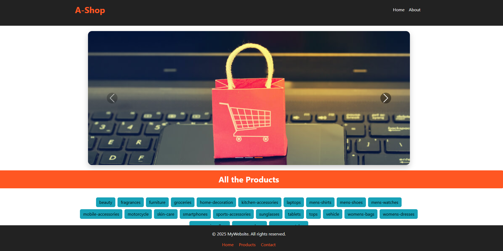
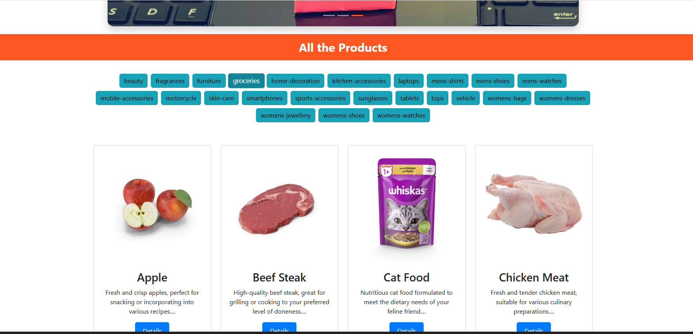
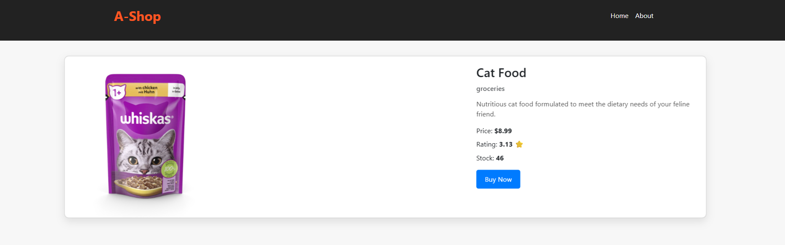

# 🛒 Simple React E-commerce  

🌐 **Live Demo:** [View Project](https://amelchenni.github.io/)  

---

## 📖 Description  
The **Simple React E-commerce** is a beginner-friendly online shopping app built with React.  
It allows users to browse products by category, view details of each product, and navigate between pages.  
This project is designed as practice for React state management (`useState`), routing (`react-router-dom`), and building dynamic components.

---

## 🚀 Features  
- 🛍️ Browse a list of products.  
- ➕ Add products to the shopping cart.  
- 🛒 View and manage cart items.  
- 📝 Simple checkout form using **Formik**.  
- 💾 Data persistence using React state (optional: can be extended to localStorage).  
- 🎨 Responsive UI for desktop and mobile devices.  

---

## 🛠️ Technologies Used  
- **React (Hooks: useState, useEffect)** – Component logic & state handling  
- **React Router DOM** – Client-side routing  
- **Formik** – Form handling and validation  
- **JavaScript (ES6)** – Core functionality  
- **HTML5** – Structure  
- **CSS3 & Bootstrap 5** – Styling & responsive layout  
- **Axios** – Optional for fetching data from APIs  

---

## 📷 Preview  
  
---

  
---

  


---

## 📌 Future Improvements  
- Add **product categories and filters**.  
- Implement **user authentication** (login/signup).  
- Persist cart data in **localStorage** or backend database.  
- Add **payment integration**.  
- Improve UI with **animations and themes**.  

---

## ▶️ Usage  
1. Clone this repository:  
   ```bash
   git clone https://github.com/AmelChenni/simple-react-e-commerce.git
